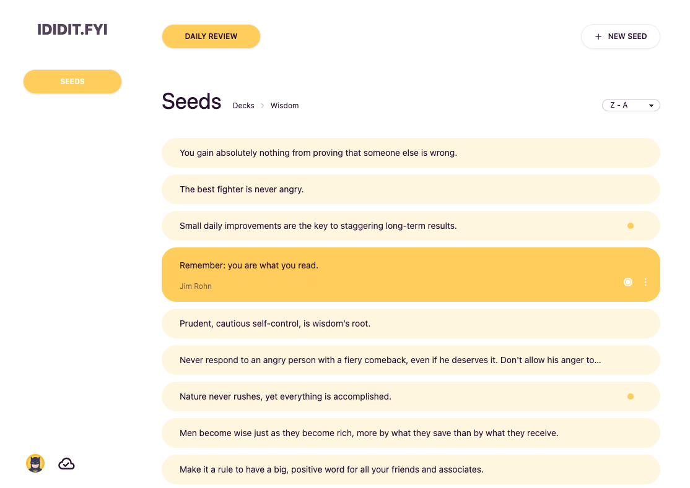

# ididit.fyi

Build your own library of wisdom.   
Available DEMO version without registration.
 
[See now!](https://ididit.fyi/)

## How it works

- <b>Seeds</b> are valuable thoughts which thanks to repetition 'germinate' and gradually become a part of your worldview
- Save seeds in <b>decks</b> (optionally with author and source)
- Once a day (at 4 a.m.) new <b>daily review</b> is generated
- Each seed can be marked to be shown every day in the review
- Daily review content is based on decks' limits

Example: there are 10 cards in a deck and the deck's limit is 2 - every day two random seeds will be shown among these ten.

_Daily Review_

### Other functionality

- Decks and seeds can be sorted
- Decks can be ordered using drag & drop (custom option)
- The order od decks displayed in daily review is random
- When daily review is unfinished, any changes in decks' limits / seeds (to be reviewed) trigger review's update
- Seeds marked to be shown every day are excluded from deck's limit

Example: deck's limit is 0 but it contains a seed marked to be shown every day - this seed will appear in daily review anyway.

##### Authorization (Firebase Authentication)

- Registration / login with email link
- Registration / login with Google
- Login with email + password

### Technical information

##### Firestore (NoSQL)

- Each change in app is instantly synchronized with database
- Sync status is indicated by cloud / loading icon
- In case of reaching the limit of Firestore document's size - seeds, decks or daily review are moved to new or less filled docs

##### Firebase cloud functions (NodeJS)

- Registration triggers creation of predefined document for new user in database
- Account removal triggers deletion of all user's documents from database
- DEMO button triggers creation of anonymous session with predefined data copied from parent's account

## Technologies

##### Project's base:

- Typescript
- Svelte + Sveltekit
- Vite

##### Backend:

- Firebase

##### Design:

- Tailwind CSS
- DaisyUI - Tailwind components library
- Muuri - drag and drop library

##### Testing:

- Playwright

## Coming soon

- Filtering decks by name
- Filtering seeds by content, author and source
- Moving seeds between decks
- Simultaneous operations on multiple seeds
    
- Enlarged seed edit window mode
- Basic text styling in seed editor
- Authors / sources management system
- Option to add next seed with the same author and source (useful when adding multiple fragments from one book)
    
- Offline persistence and data sync when back online
- Responsive design
